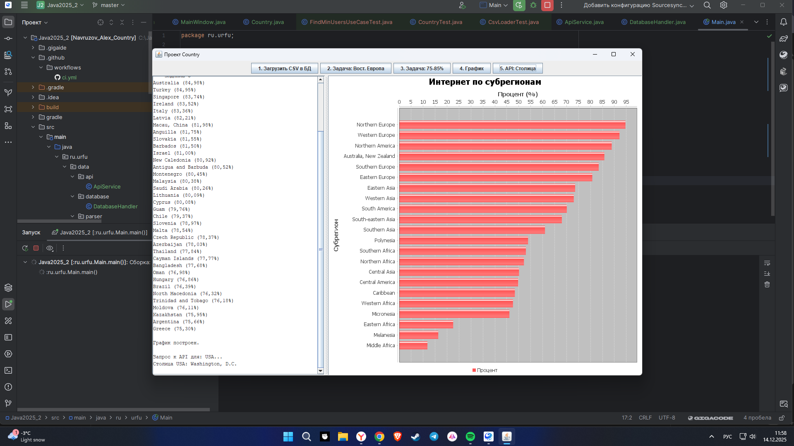

# Семестровый проект: Анализатор статистики интернет-пользователей

Проект представляет собой десктопное Java-приложение для анализа данных о населении и количестве интернет-пользователей по странам мира. Приложение реализует полный ETL-цикл: извлечение данных из CSV, их преобразование, загрузку в базу данных SQLite, а также выполнение аналитических запросов с визуализацией результатов.

## Стек технологий

*   **Язык:** Java 17
*   **Система сборки:** Gradle
*   **Графический интерфейс:** Java Swing
*   **База данных:** SQLite (через JDBC)
*   **Парсинг CSV:** OpenCSV
*   **Визуализация:** JFreeChart
*   **Тестирование:** JUnit 5, Mockito
*   **CI/CD:** GitHub Actions

## Архитектура проекта

Проект построен с использованием принципов **Clean Architecture** (Чистая Архитектура) для обеспечения слабой связности, независимости слоев и высокой тестируемости.

Структура разделена на три основных слоя:

1.  **`domain` (Доменный слой):** Ядро приложения. Содержит бизнес-логику и сущности (`Country`), правила (`UseCase`) и контракты (`Repository`). Этот слой не зависит ни от базы данных, ни от интерфейса.
2.  **`data` (Слой данных):** Реализация доступа к данным. Отвечает за получение данных из внешних источников. Включает в себя работу с базой данных (`DatabaseHandler`), парсинг файлов (`CsvLoader`) и взаимодействие с внешними API (`ApiService`).
3.  **`view` (Слой представления):** Пользовательский интерфейс. Отвечает за отображение данных и взаимодействие с пользователем. В проекте реализован с помощью Swing (`MainWindow`).

Зависимости между слоями направлены к центру, что делает бизнес-логику независимой от деталей реализации:
`view` → `domain` ← `data`

## Последовательность работы над проектом

1.  **Анализ задачи и проектирование:** Были проанализированы исходные данные в CSV-файле и спроектирована структура базы данных в **3-й нормальной форме** для устранения избыточности.
2.  **Настройка проекта:** Был инициализирован проект на Gradle, подключены все необходимые зависимости для работы с БД, CSV, графикой и тестированием.
3.  **Реализация архитектуры:** Проект был структурирован по слоям (Data, Domain, Presentation) для разделения ответственности.
4.  **Реализация слоя данных:** Написаны классы `CsvLoader` для парсинга файла и `DatabaseHandler`, реализующий интерфейс `CountryRepository` для работы с SQLite.
5.  **Реализация доменного слоя:** Создана модель `Country`, интерфейс `CountryRepository` и `UseCase` классы для каждой бизнес-задачи.
6.  **Реализация слоя представления:** Разработано десктопное приложение на Swing (`MainWindow`), которое взаимодействует с доменным слоем через UseCase'ы.
7.  **Реализация усложнений:**
    *   **Обогащение данных (API):** Добавлен `ApiService` для получения столиц стран через публичный API сайта `restcountries.com`.
    *   **Модульное тестирование:** Написаны тесты для всех слоев с использованием JUnit 5. Для `UseCase` использовалась библиотека Mockito, а для `DatabaseHandler` — in-memory база данных.
    *   **CI/CD:** Настроен workflow для GitHub Actions, который автоматически запускает сборку и все тесты при каждом коммите в репозиторий.

## Сборка и запуск

### Требования
*   JDK 17 или выше.

### Запуск из IDE
1.  Клонировать репозиторий.
2.  Открыть проект в GigaIDE как Gradle-проект(или в Maven).
3.  Запустить `Main.java`.

### Сборка и запуск исполняемого JAR-файла
1.  Открыть терминал в корне проекта.
2.  Выполнить команду для сборки:
    ```bash
    ./gradlew shadowJar
    ```
3.  Готовый JAR-файл появится в папке `build/libs/`.
4.  Запустить его из терминала командой (необходима для корректного отображения кириллицы):
    ```bash
    java -jar build/libs/CountryStatsProject-1.0.jar
    ```
    *(Необходим `Country.csv` рядом с JAR-файлом в папке, иначе будет ошибка (не найден файл)).*

## Скриншоты

### 1. Основное окно приложения



### 2. Успешное прохождение тестов и CI/CD
